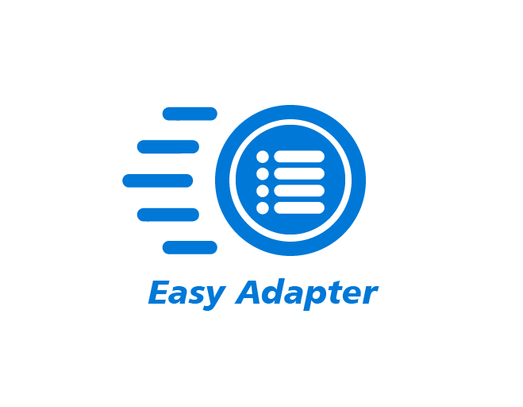

# EasyAdapter Based on [**Android Data Binding**](https://developer.android.com/topic/libraries/data-binding/index.html)



### Create your recyclerview adapter in just 3 lines.

> RecyclerView is mostly used android widgets in the Android Project, for that you have to implement an Adapter which provides the items for the view. In most cases it require the same base logic, but require you to write everything again and again.so here is sollution for it.

[](https://android-arsenal.com/details/1/6950)
[ ](https://bintray.com/mkrupal09/EasyAdapter/EasyAdapter/_latestVersion)
[](https://circleci.com/gh/mkrupal09/EasyAdapter)

- Reduce Boilerplate code to create adapter and holder.
- you can filter adapter without coding much.
- You wil have load more feature with progress bar at bottom.
- includes swipe to action.
- includes View Events callbacks (ClickEvent,CheckChangeEvent)
- and many more..


Download
--------

app > build.gradle
```groovy
implementation 'com.github.mkrupal09:EasyAdapter:v2.0.5'
```

root > build.gradle, add jitpack.io maven url in allprojects>repositories
```groovy
allprojects {
		repositories {
			...
			maven { url 'https://jitpack.io' }
		}
	}
```

To enable data binding
-------------------------

inside app build.gradle add buildFeatures block(if not) and add dataBinding flag as mentioned below
```groovy
android {
    buildFeatures {
        dataBinding true
    }
}
```

## How?
``` java 
adapter = new EasyAdapter<Category, InflaterCategoryBinding>(R.layout.inflater_category) {
            @Override
            public void onBind(@NonNull InflaterCategoryBinding binding, @NonNull Category model) {
                binding.tvName.setText(model.name);
            }
        }
        
```

## Usage


``` kotlin
class CategoryAdapter() :EasyAdapter<Category, InflaterCategoryBinding>(R.layout.inflater_category) {
    override fun onBind(binding: InflaterCategoryBinding, model: Category) {
        binding.apply {
            tvName.text = model.name
            cbCategory.isChecked = model.isSelected
        }
    }
}
```
###java 
``` java
     public CategoryAdapter() {
        super(R.layout.inflater_category);
    }

    @Override
    public void onBind(@NonNull InflaterCategoryBinding binding, @NonNull Category model) {
        binding.tvName.setText(model.name);
    }
```

#### 1) To Handle recycler View item Events 

``` kotlin
//Override in Adapter
override fun onCreatingHolder(binding: InflaterCategoryBinding, easyHolder: EasyHolder) {
        super.onCreatingHolder(binding, easyHolder)
        binding.root.setOnClickListener(easyHolder.clickListener)
    }
```

``` kotlin
adapter.setRecyclerViewItemClick { itemView, model -> 
//Perform Operation here 
}
```

#### 2) Filter (Search,etc..)
``` kotlin
adapter.performFilter(newText,filter)

val filter= object : EasyAdapter.OnFilter<Category> {
                    override fun onFilterApply(filter: Any, model: Category): Boolean {
                        return model.name.toLowerCase().contains(filter.toString().toLowerCase())
                    }

                    override fun onFilterResult(filteredList: ArrayList<Category>?) {
                        adapter.clear(false)
                        adapter.addAll(filteredList, false)
                        adapter.notifyDataSetChanged()
                    }
                }

```

#### 3) Load More
``` kotlin
adapter.setLoadMoreRes(R.layout.layout_progress)
adapter.setOnLoadMoreListener(binding.recyclerView, EasyAdapter.OnLoadMoreListener {
            if (paging != -1) {
                requestLoadMore() //Your Method
                return@OnLoadMoreListener true // Returns True if you have more data
            }
            return@OnLoadMoreListener false // Return false if you don't have more data
        })

```

#### 4) Swipe Action

``` kotlin
adapter.enableSwipeAction(binding.recyclerView)
```

``` kotlin
override fun onCreatingHolder(binding: InflaterCategoryBinding, easyHolder: EasyHolder) {
        binding.llDelete.post {
            easyHolder.setEnableSwipeToDelete(binding.llCategory, 0, binding.llDelete.measuredWidth)
        }
    }
    
```
``` xml
 <FrameLayout
        android:layout_width="match_parent"
        android:layout_height="wrap_content">

        //Swipe Reveal Layout
        <LinearLayout
            android:id="@+id/llDelete"
            android:padding="10dp"
            android:layout_gravity="end"
            android:background="@android:color/holo_red_dark"
            android:layout_width="wrap_content"
            android:layout_height="match_parent">

            <ImageView
                android:layout_width="wrap_content"
                android:layout_height="wrap_content"
                android:src="@android:drawable/ic_input_delete" />
        </LinearLayout>

        //Your container
        <LinearLayout
            android:background="@android:color/white"
            android:id="@+id/llCategory"
            android:layout_width="match_parent"
            android:layout_height="wrap_content"
            android:gravity="center_vertical"
            android:orientation="horizontal"
            android:padding="5dp"/>
            
</FrameLayout>
```

#### 5) Data Observe

``` kotlin
adapter.setOnDataUpdateListener {
            if (it.size <= 0) {
                Toast.makeText(this@MainActivity, "No Data Found", Toast.LENGTH_SHORT).show()
            }
        }
```


Support with spinner
-----------------------------

We've Created EasySpinner where you can use your EasyAdapter <br />
No need to write ArrayAdapter or CustomArrayAdapter and you'll have lots of features from EasyAdapter.

``` xml

  <easyadapter.dc.com.library.EasySpinner
            android:background="@drawable/rect_background"
            android:id="@+id/easyspinner"
            android:layout_width="220dp"
            android:layout_height="wrap_content"
            android:textColor="@android:color/black"
            android:drawableRight="@android:drawable/arrow_down_float"
            android:textColorHint="@android:color/black"
            android:padding="10dp"
            android:hint="Select Name" />
            
```

Setting adapter to EasySpinner

``` kotlin
binding.easyspinner.setAdapter(adapter)
```

you can use spinner as autocomplete textview by using

``` kotlin
 binding.easyspinner.enableAutoCompleteMode { easySpinner, text ->
            adapter.performFilter(text, filter)
}
        
```

********

That's it... you will have spinner adapter.

#### Pro Tips


Use tools attribute for previewing Layout, so you don't need to always run application

**recyclerview**
  
  ``` xml
 tools:listitem="@layout/inflater_category"
 tools:itemCount="5"
 tools:orientation="horizontal"
 app:layoutManager="android.support.v7.widget.GridLayoutManager"

```
 
**layout**
 
 ``` xml
 tools:text="Sample Text"
 tools:visibility="VISIBLE"
 tools:background="@color/colorPrimary"
```
 
**android predefine sample data**
 
``` xml
 tools:text="@tools:sample/cities,first_names,us_phones,lorem,lorem/random"
 tools:background="@tools:sample/backgrounds/scenic"
 tools:src="@tools/avatars"
```
 
**custom sample data**
 
    To create your fake/sample data folder,
    just right click on the “app” folder then “new > Sample Data directory” <br />
    create new file with "filename" and write each text by new lines
 
    file contains -
    
    Georgia <br />
    Illinois <br />
    Paris <br />
    London <br />
    
    so it will randomly pick names and display in layout by

``` xml
tools:text="@sample/filename" 
```

[ Changelog ](https://github.com/mkrupal09/EasyAdapter/releases)


### [Special Thanks to] <br />

https://github.com/alex-townsend/SwipeOpenItemTouchHelper
<br />
without this person cannot achieve swipe action in recyclerview


https://android.jlelse.eu/android-tools-attributes-listitem-sample-data-rocks-bbf49aaa9f07 <br />
for sharing knowledge of Android Tools attributes 

* Buy me a Beer. :beer: 
   
   <a href="https://www.paypal.me/mkrupal09" target="_blank"></a> 

License
=======

    Copyright 2013 DC, Inc.

    Licensed under the Apache License, Version 2.0 (the "License");
    you may not use this file except in compliance with the License.
    You may obtain a copy of the License at

       http://www.apache.org/licenses/LICENSE-2.0

    Unless required by applicable law or agreed to in writing, software
    distributed under the License is distributed on an "AS IS" BASIS,
    WITHOUT WARRANTIES OR CONDITIONS OF ANY KIND, either express or implied.
    See the License for the specific language governing permissions and
    limitations under the License.
